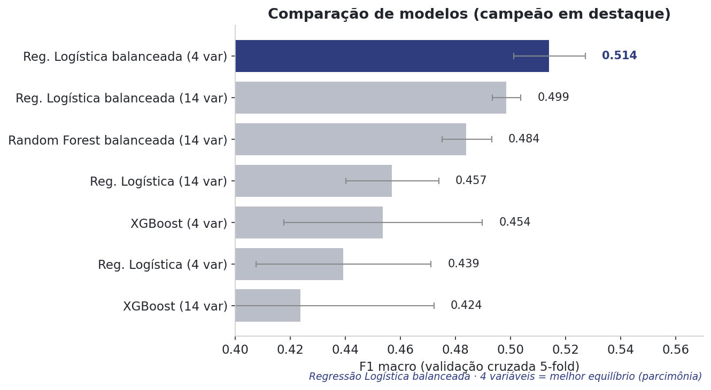
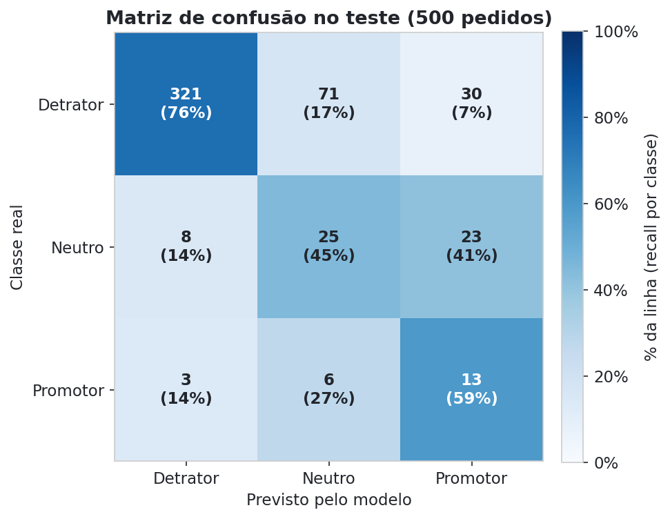
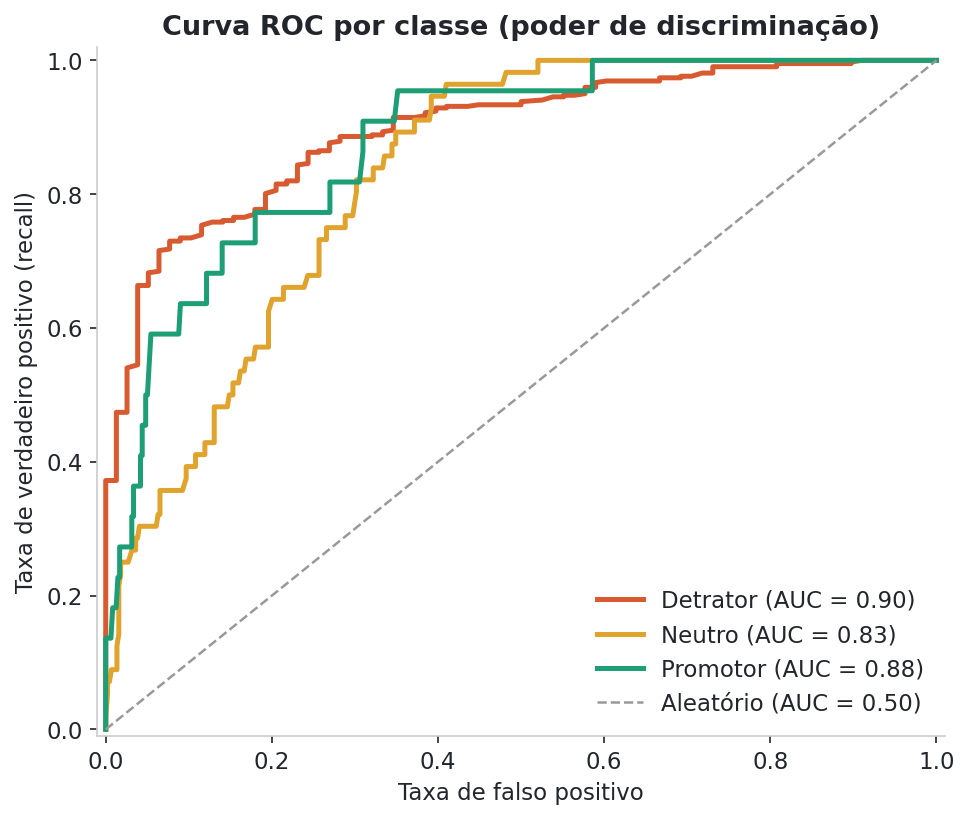
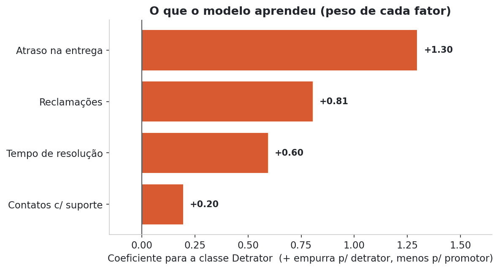

# NPS Preditivo: por que clientes viram detratores?

> **Tech Challenge · Fase 1 · Ciência de Dados e IA**
> Quais fatores da operação de um e-commerce decidem se um cliente vira promotor ou detrator? E dá para prever esse risco antes mesmo de a pesquisa de NPS chegar até ele?

---

## Sumário

- [Contexto do negócio](#contexto-do-negócio)
- [A pergunta que o projeto responde](#a-pergunta-que-o-projeto-responde)
- [O dataset](#o-dataset)
- [Metodologia (CRISP-DM)](#metodologia-crisp-dm)
- [Principais insights da análise exploratória](#principais-insights-da-análise-exploratória)
- [O modelo preditivo](#o-modelo-preditivo)
- [Recomendações para o negócio](#recomendações-para-o-negócio)
- [Limitações e riscos](#limitações-e-riscos)
- [Estrutura do repositório](#estrutura-do-repositório)
- [Como reproduzir](#como-reproduzir)
- [Próximos passos](#próximos-passos)

---

## Contexto do negócio

O e-commerce analisado cresceu rápido: mais pedidos, mais entregas, mais contato com o cliente. Esse crescimento também escancarou uma variação enorme na satisfação. Com indicadores operacionais parecidos, alguns clientes viraram fãs da marca e outros viraram detratores.

Hoje **84% dos clientes da base já são classificados como detratores**, resultando em um NPS geral de **-80**. E o problema não é só o número: hoje o NPS só é medido *depois* da compra. Quando a pesquisa chega, o pedido problemático já aconteceu e pouco pode ser feito por ele. A empresa está sempre reagindo, nunca antecipando.

O impacto disso é direto no negócio: clientes que recompraram em 30 dias têm NPS médio de **9,01**; quem não recomprou, apenas **3,94**. Satisfação puxa recompra, boca a boca e, no fim, market share.

Mais detalhes sobre o entendimento do negócio, a importância do NPS para um e-commerce e os riscos de uso da variável alvo estão documentados em [`docs/entendimento_negocio.md`](docs/entendimento_negocio.md).

## A pergunta que o projeto responde

> **Quais fatores da operação realmente decidem se um cliente vira promotor ou detrator? E é possível prever esse risco antes mesmo de a pesquisa de NPS chegar até o cliente?**

Essa pergunta orienta toda a etapa de modelagem: transformar sinais operacionais que já existem (atraso, reclamações, contatos com suporte, tempo de resolução) em um alerta antecipado de insatisfação, permitindo que a empresa aja *antes* que o cliente responda a pesquisa, e não depois.

## O dataset

A base (`data/desafio_nps_fase_1.csv`) contém **2.500 pedidos**, com 19 colunas cobrindo três frentes:

| Grupo | Variáveis |
|---|---|
| **Perfil do cliente** | idade, região, tempo de casa |
| **Pedido e pagamento** | valor, quantidade de itens, desconto, parcelas, frete |
| **Operação pós-venda** | tempo e atraso de entrega, tentativas de entrega, contatos com atendimento, tempo de resolução, reclamações |
| **Satisfação** | `nps_score` (variável alvo), CSAT interno, recompra em 30 dias |

A variável alvo `nps_score` foi transformada em três categorias, seguindo a metodologia oficial do NPS:

- **Detrator**: nota de 0 a 6
- **Neutro**: nota 7 ou 8
- **Promotor**: nota 9 ou 10

Duas colunas foram descartadas do treino por representarem **vazamento de dados** (*data leakage*), ou seja, informação que só existe *depois* do evento que queremos prever: `repeat_purchase_30d` e `csat_internal_score`.

## Metodologia (CRISP-DM)

O projeto segue o método CRISP-DM, dividido em fases:

| Fase | O que foi feito | Onde |
|---|---|---|
| 1. Entendimento do negócio | Problema, importância do NPS, áreas beneficiadas, riscos de mercado | [`docs/entendimento_negocio.md`](docs/entendimento_negocio.md) |
| 2. Definição do target | Escolha e transformação da variável `nps_score`, reflexão sobre riscos de uso | [`docs/entendimento_negocio.md`](docs/entendimento_negocio.md) |
| 3. Análise exploratória (EDA) | Teste de 15 variáveis contra o NPS, qualidade de dados, correlações | [`notebooks/EDA.ipynb`](notebooks/EDA.ipynb) |
| 4. Modelagem | Pré-processamento, comparação de modelos (Regressão Logística, Random Forest, XGBoost), ajuste de limiar | [`notebooks/Modelagem.ipynb`](notebooks/Modelagem.ipynb) |
| 5. Avaliação e entrega | Métricas por classe, matriz de confusão, curva ROC e modelo serializado | [`models/modelo_nps.joblib`](models/modelo_nps.joblib), [`reports/`](reports/) |

## Principais insights da análise exploratória

A EDA (notebook completo em [`notebooks/EDA.ipynb`](notebooks/EDA.ipynb)) foi conduzida em etapas, sempre com foco de negócio, seguindo seis passos: qualidade de dados, exploração variável por variável, ranking dos fatores críticos, o que gera detratores, ponto de ruptura na experiência e perfil do cliente.

### Qualidade dos dados

Antes de analisar, mapeamos inconsistências lógicas na base. Decidimos **manter as linhas** (volume alto demais para ser outlier pontual; provável artefato de geração sintética), mas documentá-las como limitação:

- **1,4%** dos pedidos têm desconto maior que o valor total do pedido.
- **4,84%** têm atraso maior que o próprio tempo total de entrega (o atraso deveria estar contido nele).
- **21,24%** têm reclamação registrada sem nenhum contato de atendimento, o que ajuda a explicar depois por que `resolution_time_days` é o mais fraco dos fatores relevantes (parte do sinal fica diluída por tempos de resolução que não deveriam existir).

### O que importa, por bloco operacional

A análise foi organizada em quatro blocos, e o padrão que emergiu é claro: a satisfação nasce da execução pós-venda, não da política comercial nem do perfil do cliente.

| Bloco | Veredito | Detalhe |
|---|---|---|
| **Logística** | Só o atraso importa | `delivery_delay_days` tem correlação **-0,60**; já tempo total de entrega (0,00), tentativas (0,03) e frete (-0,04) não movem o NPS. O problema não é o prazo em si, é o **descumprimento** do prazo prometido. |
| **Atendimento** | Tudo importa | Todas as variáveis pesam: reclamações (**-0,50**), contatos (**-0,35**) e tempo de resolução (**-0,19**). A experiência de suporte como um todo é a área mais sensível. |
| **Pedido / Pricing** | Nada importa | `order_value` (0,04), `items_quantity` (0,01), `discount_value` (0,02) e `payment_installments` (0,02). O cliente não vira detrator por preço. |
| **Perfil** | Nada importa | Idade (-0,01), tempo de casa (-0,01) e região (gap de só **0,28 ponto** entre Sul e Centro-Oeste). Testamos até a hipótese de a região ser um proxy de logística, mas ela caiu por terra: frete e atraso são praticamente idênticos entre regiões. |

### Ranking dos 4 fatores críticos

Das **15 variáveis testadas**, apenas **4 têm correlação relevante** com o NPS, e todas são de pós-venda:

| # | Variável | Correlação com o NPS |
|---|---|---|
| 1 | Atraso na entrega (`delivery_delay_days`) | -0,60 |
| 2 | Reclamações (`complaints_count`) | -0,50 |
| 3 | Contatos com atendimento (`customer_service_contacts`) | -0,35 |
| 4 | Tempo de resolução (`resolution_time_days`) | -0,19 |

### Perfil de detrator vs. promotor

A base tem **84,36% de detratores** (2.109 de 2.500) e um **NPS geral de -79,96**. Comparando a média de cada fator por grupo, o padrão se repete nas 4 métricas: não é quem o cliente é, e sim o que ele viveu no pedido.

| Fator (média) | Detrator | Promotor | Diferença |
|---|---|---|---|
| Atraso (dias) | 2,41 | 0,71 | ~3,4× mais |
| Reclamações (qtd) | 4,44 | 2,27 | ~2× mais |
| Contatos com suporte (qtd) | 1,63 | 0,67 | ~2,4× mais |
| Tempo de resolução (dias) | 5,69 | 3,70 | ~1,5× mais |

Nos boxplots, o **atraso** é o fator que melhor separa os três grupos individualmente (caixas quase sem sobreposição); já `customer_service_contacts` discrimina pouco sozinho (Detrator e Neutro têm a mesma mediana de 1 contato).

### Ponto de ruptura na experiência

O cliente **não dá desconto de tolerância**: a reação é imediata.

- **Atraso**: com 0 dias, 51,6% já são detratores; com **apenas 1 dia**, salta para **74%** (+22 pontos). Não existe zona de tolerância.
- **Reclamações**: entre a 1ª e a 2ª, o percentual de detratores salta de **30,3% para 65,3%** (+35 pontos), o maior salto de toda a análise.

Entre os dois, **a reclamação é o gatilho mais acionável**: o atraso só é percebido depois que o pedido já saiu errado, mas a 2ª reclamação é um evento monitorável em tempo real, então a empresa ainda está a tempo de agir.

### Duas métricas internas (não entram no modelo)

- **CSAT interno**: correlação de 0,56 com o NPS (concordam, em geral), mas 18,5% da base tem CSAT = 0 espalhado por toda a faixa de NPS, sinal de que o CSAT não captura a experiência tão bem quanto o NPS nesse grupo.
- **Recompra em 30 dias**: é **consequência** do NPS (e *leakage*), não causa. Ainda assim é reveladora: quem recomprou tem NPS médio de **9,01**; quem não recomprou, **3,94**.

> **Robustez do achado:** duas abordagens independentes (força da correlação e comparação de perfil por grupo) convergem para os **mesmos 4 fatores**, o que reforça a confiabilidade da conclusão.

## O modelo preditivo

**Abordagem:** classificação (Detrator / Neutro / Promotor), e não regressão sobre a nota de 0 a 10. Errar por pouco (prever 8 quando o real é 10) tem impacto de negócio muito menor do que errar a categoria (classificar como promotor quem na verdade é neutro).

**Pipeline final** (`models/modelo_nps.joblib`):

- **Variáveis preditoras (4)**: `delivery_delay_days`, `complaints_count`, `customer_service_contacts` e `resolution_time_days`, exatamente as 4 variáveis que a EDA identificou como relevantes.
- **Pré-processamento**: padronização (`StandardScaler`) das variáveis numéricas.
- **Modelo**: Regressão Logística com `class_weight='balanced'`, para compensar o forte desbalanceamento da base (84% detratores vs. 4% promotores).
- **Validação**: como os resultados variavam de forma relevante conforme o `random_state`, a avaliação passou a usar **validação cruzada estratificada de 5 folds** em vez de uma única divisão treino/teste, reduzindo a dependência de um único split.

### Comparação dos modelos testados

Sete configurações foram comparadas por **validação cruzada estratificada (5 folds)** no conjunto de treino, usando o **F1 macro** como métrica principal, porque ela dá o mesmo peso às três classes. Isso é essencial numa base tão desbalanceada (senão bastaria "chutar detrator" para todo mundo e acertar 84%).



| Modelo | Variáveis | F1 macro (CV) |
|---|---|---|
| **Regressão Logística balanceada** (campeão) | 4 | **0,514 ± 0,013** |
| Regressão Logística balanceada | 14 | 0,499 ± 0,005 |
| Random Forest balanceada | 14 | 0,484 ± 0,009 |
| Regressão Logística | 14 | 0,457 ± 0,017 |
| XGBoost | 4 | 0,454 ± 0,036 |
| Regressão Logística | 4 | 0,439 ± 0,032 |
| XGBoost | 14 | 0,424 ± 0,048 |

Os dois melhores modelos (Regressão Logística balanceada com 4 e com 14 variáveis) empataram tecnicamente. Aplicando o **princípio da parcimônia**, escolhemos o mais simples: o modelo mais enxuto (Regressão Logística) com apenas as **4 variáveis** da EDA superou modelos mais complexos como Random Forest e XGBoost com todas as 14 variáveis. Menos é mais: além do melhor F1 macro, ganhamos explicabilidade e um modelo mais fácil de colocar em produção.

### Desempenho do modelo final no teste

Avaliado nos **500 pedidos** do conjunto de teste (20% da base, nunca vistos pelo modelo):

| Classe | Precisão | Recall | F1 | Nº de pedidos |
|---|---|---|---|---|
| Detrator | 0,97 | 0,76 | 0,85 | 422 |
| Neutro | 0,25 | 0,45 | 0,32 | 56 |
| Promotor | 0,20 | 0,59 | 0,30 | 22 |
| **Acurácia** | | | **0,72** | 500 |
| **Média macro** | 0,47 | 0,60 | 0,49 | 500 |

> **Como ler:** *precisão* = quando o modelo diz "é detrator", quantas vezes acerta (0,97 = quase sempre). *Recall* = dos detratores reais, quantos o modelo consegue pegar (0,76 = 3 em cada 4).

**Matriz de confusão** (cada célula mostra a contagem e o % da linha, ou seja, o recall por classe):



O modelo é forte onde o negócio mais precisa, que é identificar detratores (76% de recall com 97% de precisão). Ele confunde mais as classes minoritárias (neutro e promotor), simplesmente porque teve poucos exemplos delas para aprender.

### Poder de discriminação (AUC por classe)

A **AUC** mede o quão bem o modelo separa cada classe das demais (0,5 = chute; 1,0 = separação perfeita). Mesmo com o desbalanceamento, a capacidade de ordenar risco é boa nas três categorias:



| Classe | AUC |
|---|---|
| Detrator | 0,90 |
| Promotor | 0,88 |
| Neutro | 0,83 |

Isso mostra que o modelo **sabe separar as classes probabilisticamente**. O problema no limiar padrão não é falta de sinal, e sim o corte de 0,50, que não é o ideal para maximizar o recall de detrator (ver ajuste de limiar abaixo).

### O que o modelo aprendeu (coeficientes)

Por ser uma Regressão Logística, o modelo é totalmente interpretável. Os coeficientes confirmam a intuição de negócio da EDA, já que todos apontam sempre positivo para Detrator e negativo para Promotor:



- **`delivery_delay_days`** é o driver dominante (coeficiente **1,30** para Detrator, **-1,07** para Promotor).
- **`complaints_count`** vem em seguida (**0,81**).
- **`customer_service_contacts`** é o mais fraco dos quatro, discriminando pouco entre Detrator e Neutro, coerente com o que os boxplots da EDA já mostravam.

### Análise de erro

Os erros mais graves (Detrator confundido com Promotor) se concentram na região de **baixo atraso (0 a 3 dias)** combinada com valores intermediários de reclamações e tempo de resolução, exatamente a zona cinzenta onde os grupos se sobrepõem. Fora dela, o modelo acerta com folga.

### Ajuste de sensibilidade (limiar de decisão)

Como o objetivo de negócio é **não deixar detrator passar**, dá para baixar o limiar de decisão da classe Detrator (de 0,50 para ~0,15) e priorizar o recall:

| Métrica (classe Detrator) | Limiar padrão (0,50) | Limiar ajustado (0,15) |
|---|---|---|
| Recall (detratores capturados) | 76% | **90%** |
| Precisão | 97% | 93% |
| Acurácia geral | 72% | **81%** |

Ou seja, é possível capturar **até 9 em cada 10 detratores reais** antes da pesquisa de NPS chegar. O custo é que o modelo passa a identificar corretamente **menos neutros** (recall de neutros cai de 45% para 21%, pois muitos são reclassificados como detrator). É uma troca entre "pegar todo mundo em risco" e "não gerar alarme falso", e é uma decisão de negócio, não só técnica.

O passo a passo completo (comparação de modelos, matriz de confusão, curva ROC, importância das variáveis e serialização) está em [`notebooks/Modelagem.ipynb`](notebooks/Modelagem.ipynb).

## Recomendações para o negócio

1. **Alerta antecipado de atraso**: disparar um aviso automático assim que a logística prever risco de atraso, antes que o cliente perceba sozinho.
2. **Escalonamento na 2ª reclamação**: ativar atendimento prioritário e ação proativa (cupom, frete grátis) assim que o sistema detectar a segunda reclamação do cliente, o ponto de ruptura identificado na EDA.
3. **Priorização por risco**: usar o modelo preditivo para direcionar essas ações aos clientes de maior risco, e acompanhar o NPS mensal para medir o impacto.

## Limitações e riscos

- **Qualidade da base**: 1,4% dos pedidos têm desconto maior que o valor total; 4,84% têm atraso maior que o próprio tempo de entrega; 21,2% têm reclamação sem contato de atendimento registrado.
- **Base desbalanceada**: 84% detratores e apenas 4% promotores. O modelo aprende muito mais sobre detratores do que sobre clientes satisfeitos, e erra mais nessas categorias minoritárias.
- **Troca entre acertos e alarmes falsos**: capturar mais detratores (recall de 76% para 90%) reduz a taxa de neutros corretamente identificados (recall de 45% para 21%). É uma decisão que precisa envolver o negócio, não só a área técnica.
- **Validação recomendada**: testar as ações propostas em um piloto controlado, em uma região, antes de escalar para toda a base de clientes.

## Estrutura do repositório

```
.
├── data/
│   └── desafio_nps_fase_1.csv      # base de dados original (2.500 pedidos)
├── docs/
│   └── entendimento_negocio.md     # Fase 1 e 2 do CRISP-DM
├── notebooks/
│   ├── EDA.ipynb                   # Fase 3: análise exploratória
│   └── Modelagem.ipynb             # Fase 4: modelagem e avaliação
├── models/
│   └── modelo_nps.joblib           # pipeline final serializado (scikit-learn)
└── reports/                        # figuras de resultado geradas a partir dos notebooks
    ├── comparacao_modelos.png
    ├── matriz_confusao.png
    ├── curva_roc.png
    └── importancia_variaveis.png
```

## Como reproduzir

```bash
git clone https://github.com/NotRuan/tech-challenge-nps.git
cd tech-challenge-nps
pip install pandas numpy scikit-learn xgboost joblib matplotlib seaborn jupyter
jupyter notebook notebooks/EDA.ipynb
```

Para carregar o modelo já treinado e gerar previsões:

```python
import joblib

modelo = joblib.load("models/modelo_nps.joblib")

# colunas esperadas: delivery_delay_days, complaints_count,
# customer_service_contacts, resolution_time_days
modelo.predict(novos_pedidos)
```

## Próximos passos

- Coletar mais exemplos de clientes neutros e promotores para reduzir o desbalanceamento da base.
- Rodar um piloto controlado das ações propostas em uma região antes de escalar.
- Monitorar o NPS mensal após a implantação dos alertas, para medir o impacto real do modelo.
